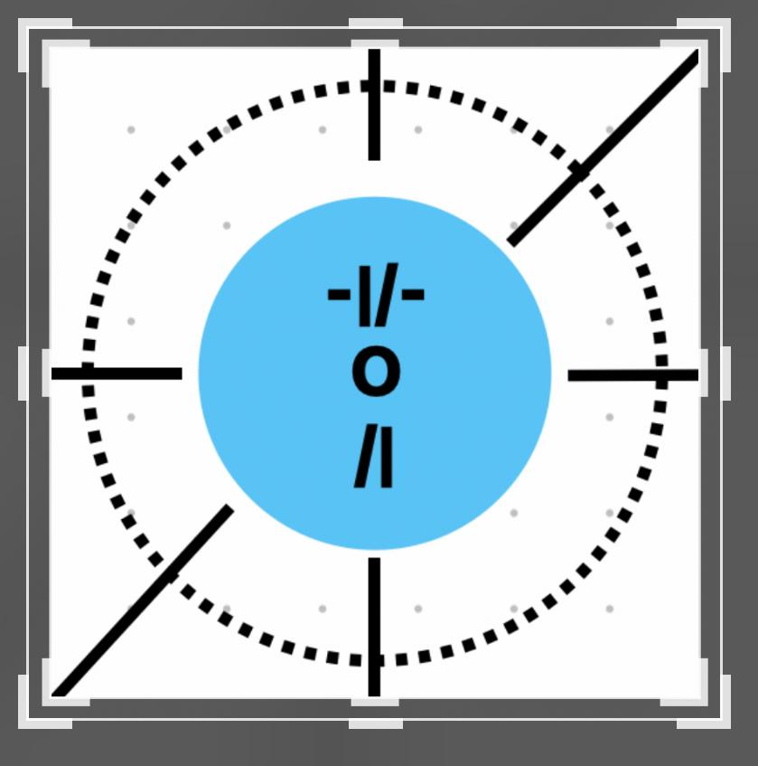

# Circle - WebRTC Group Chat App



A hybrid mobile app that combines WebRTC group chat with face detection and location-based features.

## Overview

Circle is a modern communication platform that enables real-time group video chat with advanced features like face detection and location sharing. Built with React Native and Expo, it provides a seamless experience across iOS and Android devices.

## Features

- **WebRTC Group Chat**: Real-time video and audio communication
- **Face Detection**: Secure circle creation and joining using facial recognition
- **Location Services**: Share and view participant locations
- **VR Integration**: Virtual reality view of circle participants
- **Cross-Platform**: Works on both iOS and Android

## Documentation

- [Main Documentation](README.md) - This file
- [Position System & VR Guide](README2.md) - Detailed guide for location and VR features
- [Development Guide](README3.md) - Development setup and testing guidelines

## Getting Started

1. Clone the repository
2. Install dependencies: `npm install`
3. Start the development server: `npm start`
4. Run on your device or simulator

## Project Structure

```
Circle/
├── src/
│   ├── components/     # Reusable UI components
│   ├── screens/        # Screen components
│   ├── assets/        # Images and other assets
│   └── utils/         # Utility functions
├── server/            # Backend server
├── ios/              # iOS specific files
├── android/          # Android specific files
└── package.json      # Project dependencies
```

## Contributing

Please read our [Development Guide](README3.md) for details on our code of conduct and the process for submitting pull requests.

## License

This project is licensed under the MIT License - see the LICENSE file for details.
