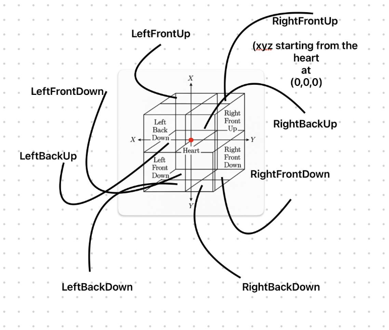

# Position System and VR Features

## Position System (PosSys)

The PosSys feature implements a unique 3D coordinate system called Continuom, which maps positions to both a 2D map interface and a VR space using the device's current location and orientation.

### Continuom Coordinate System

The Continuom system defines 8 unique positions in 3D space with perspective-based scaling, centered around the Heart. Each position name follows the pattern [Side][Front/Back][Up/Down], where:
- Side is either Left (L) or Right (R)
- Front/Back indicates position relative to the Heart
- Up/Down indicates vertical position relative to the Heart



```javascript
const Continuom = [
  // Right side positions with perspective scaling
  { 
    id: 0, 
    name: 'RightFrontUp', 
    cor: { x: 0, y: 0, z: 0 },
    perspective: { scale: 1, depth: 0 }
  },
  // ... other positions
];
```

Each position is defined by:
- `id`: Unique identifier (0-7)
- `name`: Descriptive name following [Side][Front/Back][Up/Down] pattern
- `cor`: Continuom coordinates (x, y, z) relative to the Heart
- `perspective`: Scaling and depth information
  - `scale`: Base scaling factor (1 for front, 0.8 for back)
  - `depth`: Depth factor (0 for front, 1 for back)

```
    Front View (Scale: 1.0)        Back View (Scale: 0.8)
    ┌─────────┐                    ┌─────────┐
    │  RFU    │                    │  RBU    │
    │  (0)    │                    │  (2)    │
    ├─────────┤                    ├─────────┤
    │  RFD    │                    │  RBD    │
    │  (1)    │                    │  (3)    │
    └─────────┘                    └─────────┘

    Left View (Scale: 0.9)         Right View (Scale: 0.9)
    ┌─────────┐                    ┌─────────┐
    │  LFU    │                    │  RFU    │
    │  (4)    │                    │  (0)    │
    ├─────────┤                    ├─────────┤
    │  LFD    │                    │  RFD    │
    │  (5)    │                    │  (1)    │
    └─────────┘                    └─────────┘

    Top View (Scale: 1.0)          Bottom View (Scale: 0.8)
    ┌─────────┐                    ┌─────────┐
    │  RFU    │                    │  RFD    │
    │  (0)    │                    │  (1)    │
    ├─────────┤                    ├─────────┤
    │  LFU    │                    │  LFD    │
    │  (4)    │                    │  (5)    │
    └─────────┘                    └─────────┘

Legend:
- RFU: Right Front Up (0)
- RFD: Right Front Down (1)
- RBU: Right Back Up (2)
- RBD: Right Back Down (3)
- LFU: Left Front Up (4)
- LFD: Left Front Down (5)
- LBU: Left Back Up (6)
- LBD: Left Back Down (7)

Position Naming Convention:
- First letter: Side (L/R)
  - L = Left
  - R = Right
- Second letter: Front/Back (F/B)
  - F = Front (towards Heart)
  - B = Back (away from Heart)
- Third letter: Up/Down (U/D)
  - U = Up
  - D = Down

Perspective Scaling:
- Front positions: 1.0 scale
- Back positions: 0.8 scale
- Side positions: 0.9 scale
- Depth factor increases from front (0) to back (1)
```

### QubPix Visualization

The Continuom positions are visualized in VR using QubPix (colored cubes):

1. Each position generates a 32x32x32 grid of QubPix
2. QubPix properties:
   - Color: Based on position and coordinates
   - Scale: Affected by perspective and depth
   - Intensity: Varies with distance from center
   - Position: Mapped to 3D space with perspective scaling

3. Interactive features:
   - Hover effects scale up QubPix by 20%
   - Smooth transitions for all animations
   - Real-time updates through WebSocket

4. Perspective effects:
   - Front positions appear larger and closer
   - Back positions appear smaller and further away
   - Grid lines create depth perception
   - Color intensity varies with distance

### Using PosSys

1. Tap the "Position System" button on the home screen
2. Allow location access when prompted
3. The map interface shows all 8 Continuom positions centered on your current location
4. Select a position by:
   - Tapping the position button in the control panel
   - Tapping the marker on the map
5. The map will animate to show the selected position
6. Device orientation affects the positioning:
   - Up/Down is represented by zoom level and device tilt
   - North/South/East/West are represented by position on the map
   - Real-time accelerometer data adjusts the view
7. Toggle the Continuom grid:
   - Tap the "Hide Grid" button in the top-right corner to hide the grid
   - Tap "Show Grid" to display the grid again
   - Grid visibility state persists during the session

### Position Mapping Example

```javascript
// Convert Continuom coordinates to QubPix
const convertContinuomToPixels = (position) => {
  const gridSize = 32;
  const pixels = [];
  
  // Calculate base position and perspective scaling
  const baseX = position.cor.x ? 0 : gridSize / 2;
  const baseY = position.cor.y ? 0 : gridSize / 2;
  const baseZ = position.cor.z ? 0 : gridSize / 2;
  const perspectiveScale = position.perspective.scale;
  const depthFactor = position.perspective.depth;
  
  // Generate QubPix with color and position
  for (let x = 0; x < gridSize; x++) {
    for (let y = 0; y < gridSize; y++) {
      for (let z = 0; z < gridSize; z++) {
        pixels.push({
          x: (x - baseX) * perspectiveScale * (1 - depthFactor * 0.1),
          y: (y - baseY) * perspectiveScale * (1 - depthFactor * 0.1),
          z: (z - baseZ) * perspectiveScale * (1 - depthFactor * 0.1),
          color: calculateColor(x, y, z),
          intensity: calculateIntensity(x, y, z),
          scale: perspectiveScale * (1 - depthFactor * 0.1)
        });
      }
    }
  }
  
  return pixels;
};
```

### VR Visualization

The PosSys positions are visualized in VR using A-Frame:

1. Each position is represented as a grid of QubPix
2. QubPix are positioned in 3D space based on their Continuom coordinates
3. Color and intensity are calculated based on position and distance from center
4. Real-time updates when positions change
5. Interactive hover effects on QubPix

### Sharing Positions

1. Select a Continuom position
2. Tap "Share Position" to broadcast your position to circle members
3. Other members will see your position in their VR view
4. Tap "Stop Sharing" to end position sharing

---

[Continue to Development Setup and SyncMode](README3.md) 